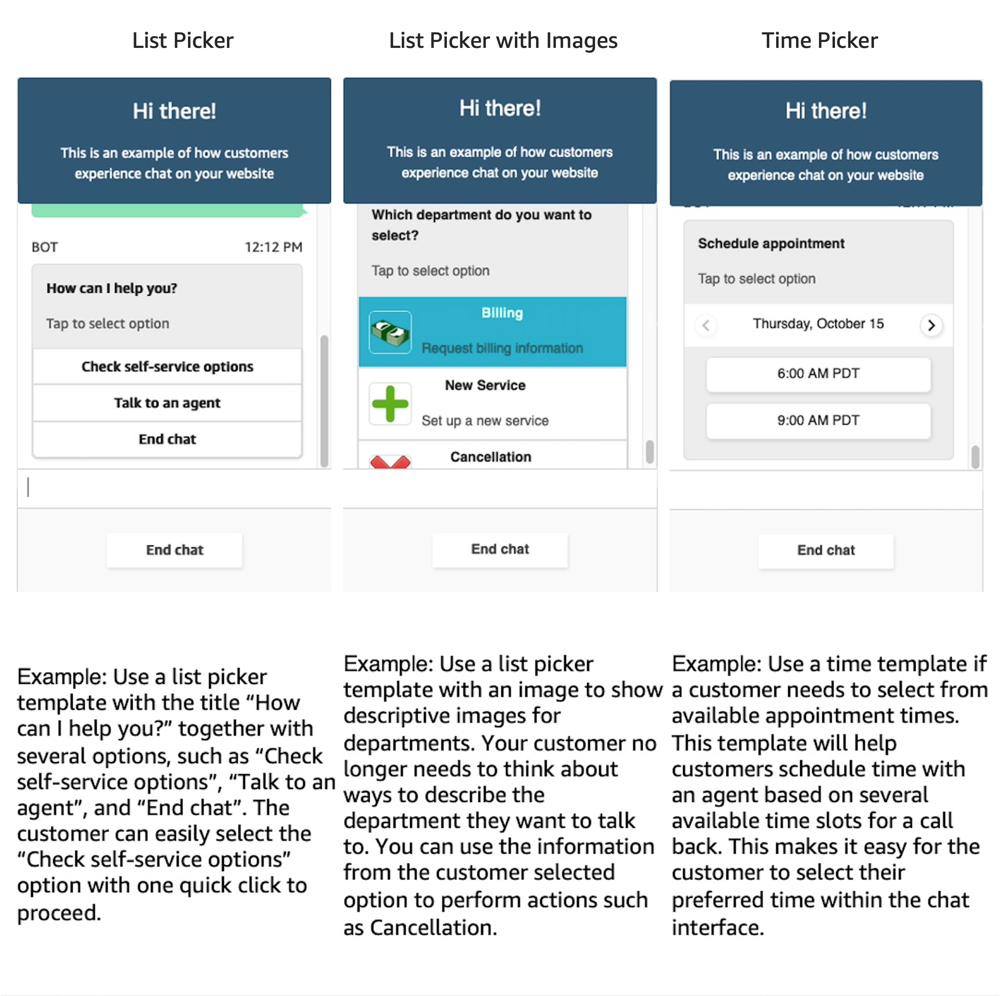

---
title: "2. 使用Lex创建智能聊天机器人"
chapter: false
weight: 20
tags:
  - advanced
---

## 使用Amazon Connect 与 Amazon Lex创建交互式体验的智能聊天机器人

在这个模块，我们创建一个基于Amazon Connect 与 Amazon Lex的交互式体验的智能聊天机器人用来智能客服场景，该机器人具备一下功能：
* 通过 Amazon Connect Chat UI集成到客户端，并使聊天机器人具备智能对答与人工客服的功能
* Amazon Connect Chat UI与Amazon Lex集成过程中，具备交互式体验能力
* 使用Amazon Connect CCP，集成到客户系统后台，使其具备后台集成能力

### 什么是交互式消息的 Amazon Connect Chat

交互式消息是指在一些客户场景下，对用户交互过程提供选项式的交互体验，用户无需手动输入，而是点击选项即可，Amazon Connect提供了与Lex集成的方式，可以通过Connect的Contact Flow进行路由后到Lex，Lex通过对交互过程使用定制的Lambda进行消息处理后，将选项显示给Connect后显示给客户用于交互；

在此过程中Connect Chat提供了3种类型的交互式模版以供Lex进行集成：

### 本次实验包括：

* 介绍什么是Lex？
* 创建可交互式体验的Lex聊天机器人
* 与Amazon Connect进行集成
* 集成Amazon Connect CCP

### 本次实验使用到的AWS服务：
* Amazon Connect
* Amazon Lex
* CloudFormation
* API Gateway
* CloudFront
* S3
* Lambda
* DynamoDB
